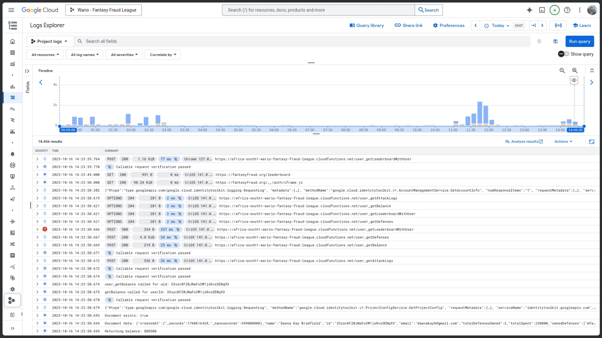
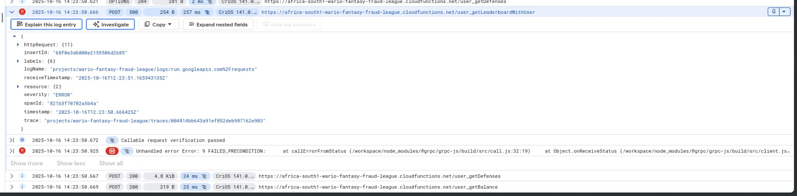
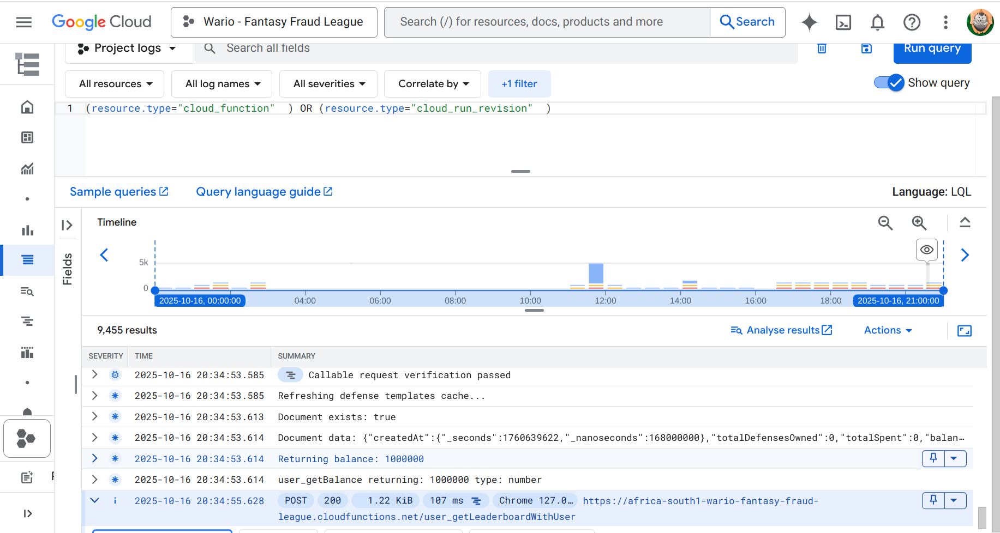

# Maintenance & Debugging Documentation
This document demonstrates our systematic approach to maintaining production-ready software, including a real-world example of error diagnosis and resolution.
## Table of Contents
1. Maintenance Philosophy
2. Error Diagnosis Workflow
3. Example

## Maintenance Philosophy

Our approach to software maintenance prioritizes:

- Monitoring: Issues are caught before users report them.
- Systematic Diagnosis: Structured investigation process - Log inspections
- Documentation: Every significant issue is documented for future reference
- Continuous Improvement: Performance metrics guide optimization efforts

This reflects industry practices for maintaining production systems.

## Error Diagnosis Workflow
### 1. Detection:
- Identify the error

### 2. Investigation:

- We attempted to follow this procedure: 
- Reproduce the issue (with screenshots documenting the error state)
- Check performance metrics (identify affected components)
- Review logs (trace the error through the system)

### 3. Resolution:

- Implement fix
- Document the solution
- Verify correction with logs

## Example: Leaderboard display for users outside top 10
The error that appeared on screen:

The error picked up in logs:

What the error message told us:

This told us that the error was picked up in our user_getLeaderboardWithUser function. The error message FAILED_PRECONDITION led us to discover it was a firebase indexing error, which we were able to correct.

What the corrected logs showed afterwards:
