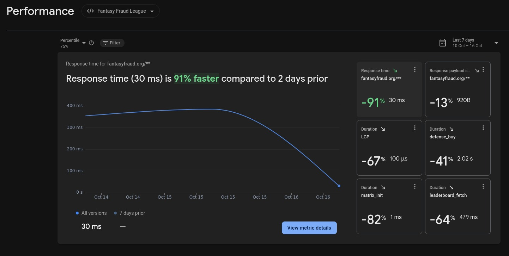
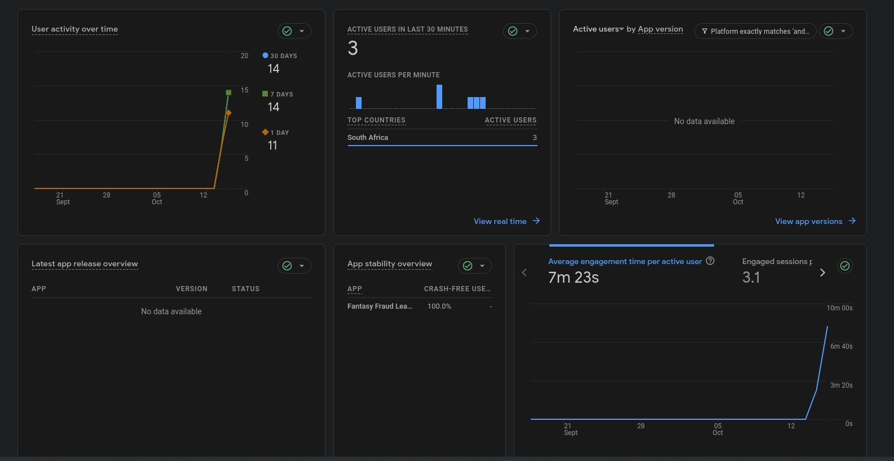
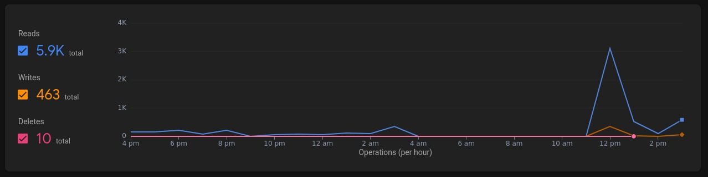

# Performance Monitoring Documentation
Custom-built performance monitoring infrastructure using Firebase Performance Monitoring and Google Analytics 4.

## Overview
We implemented comprehensive performance tracking from scratch. This demonstrates production-ready practices beyond basic application development.

Monitoring Stack:
- Firebase Performance Monitoring (Core Web Vitals + Custom Traces)
- Google Analytics 4 (User behavior tracking)
- Google Cloud Logs (Request monitoring)

## Core Web Vitals Implementation
Tracking all five Google Core Web Vitals metrics:
```
export function reportWebVitals() {
  // Cumulative Layout Shift - visual stability
  getCLS((metric) => {
    sendToFirebasePerformance(metric);
  });

  // First Input Delay - interactivity
  getFID((metric) => {
    sendToFirebasePerformance(metric);
  });

  // First Contentful Paint - loading performance
  getFCP((metric) => {
    sendToFirebasePerformance(metric);
  });

  // Largest Contentful Paint - loading performance
  getLCP((metric) => {
    sendToFirebasePerformance(metric);
  });

  // Time to First Byte - server response time
  getTTFB((metric) => {
    sendToFirebasePerformance(metric);
  });
}
```

## Metrics Tracked:
- CLS: Visual Stability
- FID: Interactivity responsiveness
- FCP: Initial load performance
- LCP: Main content load performance
- TTFB: Server response time

## Custom Performance Traces
Reusable utils for tracking game operations:
```
export async function measureAsync(traceName, asyncFn, attributes = {}) {
  const customTrace = startCustomTrace(traceName, attributes);
  try {
    const result = await asyncFn();
    customTrace.stop();
    return result;
  } catch (error) {
    customTrace.putAttribute("error", error.message);
    customTrace.stop();
    throw error;
  }
}
// Usage example
await measureAsync("buy_defense", async () => {
  await buyDefenseFunction();
}, { defense_id: defenseId, defense_name: "MFA" });

```
This is able to track:
- Operation duration
- Custom attributes (defense type)
- Error information on failures

## Some notable results:

Achieved Improvements:
- Response time: 330ms -> 30ms (91% faster)
- LCP: 300microsec -> 100microsec (67% faster)
- Defense purchases: 3.4s -> 2.02s (41% faster)
- Leaderboard fetch: 1.3s -> 479ms (64% faster)


- Active users: 14 users tracked over 30 days
- Engagement Time: 7m23s average
- Crash-Free Rate: 100%
- Engagement Rate: 89%-93% across user segments


- Read/write ratio: 12.7:1
- Caching implemented for frequently accessed data

This demonstrates production ready skills: building monitoring infrastructure tailored to our application, not just defaults