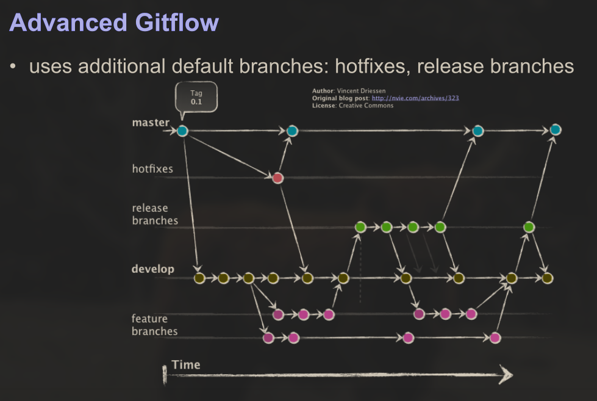
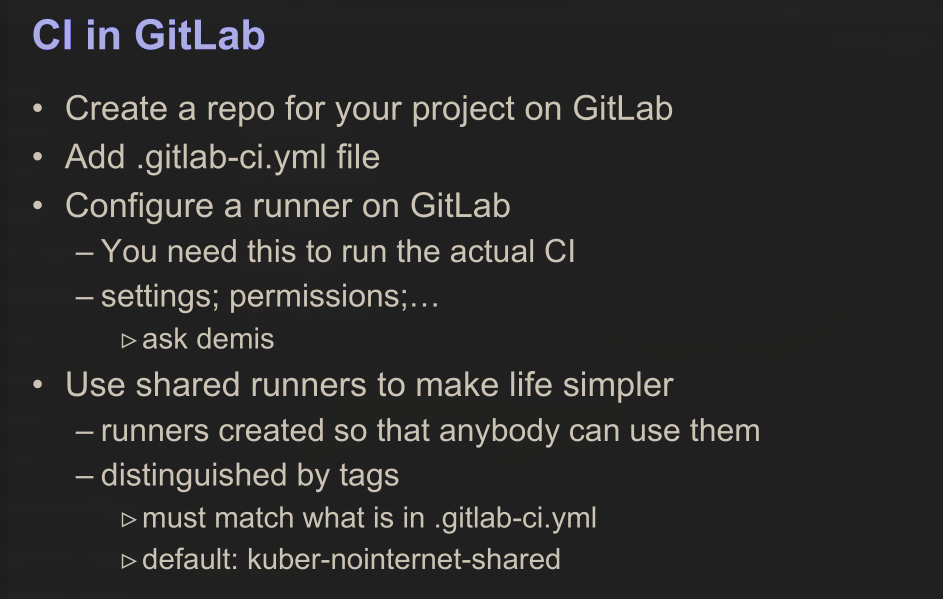
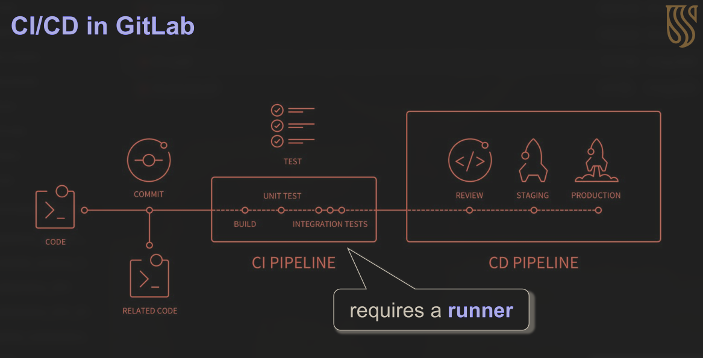

# Development Strategies

One of the main things we are supposed to learn this semester is using industry standard development systems to complete a project.
There is tons of tedious stuff we thus have to do, to score marks.
Development Strategies and documentation will probably be just as important as the development of the software itself.

## Git Workflow

*This is a quite important one I don't know why I put it so far down on the list.*
*Lemme just - Ok that's better.*
Git workflow is something he takes very seriously. As shown with tut01, git history will probably be judged and marked quite harshly.
I think it best then, we establish some conventions regarding our git workflow.

### Commits

I mentioned this to AB briefly and he mentioned maybe using the following convention which I think sounds good.
Commit Message Format:

> Header:
>
> - `<type>(<scope>): <subject>`
>   - Type: Categorizes the change (e.g., `feat` for new features, `fix` for bug fixes, `refactor` for code restructuring, `docs` for documentation changes).
>   - Scope: Specifies the part of the codebase affected (e.g., `auth`, `ui`, `database`).
>   - Subject: A concise, imperative, present-tense summary of the change, typically limited to 50 characters and without ending punctuation.

### Git Branch Statagy

There are a few mentioned, however I think we should use a simplified version of the follow he mentioned.
Where we this gitflow **without the hotfix and release branch**. Because why would we need that. 

### Code Review and Pull Requests

I think as a rule we can maybe do this everytime before merging into the development branch. I think that seems reasonable.

## Some other necessary strategies for industry standard development

A few he mentioned in class were as follows:

### Continuous Integration (CI/CD Pipeline)

I think we can do this exactly as stated, I already started writing a .gitlab-ci.yml. I plan to use firebase deploy to and react build together to serve as the runner.
Maybe one thing we can do is set up CD from development branch to main merging, with firebase deploy and then CI for any feature branches into development with firebase emulators. This should be pretty easy to do if you do one you might as well do the other. Takes maybe a few extra minutes to set up.

### GitLab Runner

I feel like we should probably set up docker with our gitlab runner. After all this project is about learning about such processes, but of course I don't feel like doing it at all. 
To quote his notes:
*GitLab Runner:*

- *Something that can execute your pipeline*
- *Commonly using docker*
- *Specify the docker image and how to run*
- *When a commit comes in, the docker image is created and the code executed*
- *These runners can be pre-configured or you have to create your own*

### Build systems

Our build system should be centered around Firebase and uses React as the frontend framework. We rely on Firebase tools to simulate and deploy our application, and we optimize our build process for both local development and CI/CD pipelines.
***Build Strategy\***

- React builds normally via `npm run build` from the `frontend/` directory.
- The build outputs into`/build` directory at the root level. This means I need to reconfigure Firebase Hosting and CI/CD config to handle this.
- We use Firebase Emulators locally to simulate Firestore, Auth, and Functions for development and testing.

We can set up some makefiles to make quick builds for between commits.
Specifically I was thinking about a directory structure as follows. 

my-app/
├── functions/ # Cloud Functions backend (The things I have been going on about)
│ ├── index.js # Entry point for Cloud Functions
│ ├── package.json # Functions dependencies
│ └── ... # Other function files/modules
│
├── firestore.rules # Firestore security rules
├── firestore.indexes.json # Firestore indexes config
│
├── frontend/                        # React frontend
│   └── build/                        # Output folder for React build TODO: I should configure to be targeted by Firebase Hosting
│
│   ├── public/                       # TODO: I should configure firebase.json to make this structure work
│         └── index.html 
│   ├── src/
│   │   ├── assets/                 # Images, icons, etc.
│   │   ├── components/            # Reusable UI components
│   │   ├── pages/                 # One page per fraud type
│   │   │   ├── LoginPage.jsx
│   │   │   ├── Dashboard.jsx
│   │   │   └── FraudPages/
│   │   │         ├── Phishing.jsx
│   │   │         ├── ATMFraud.jsx
│   │   │         ├── DeepfakeFraud.jsx
│   │   │         └── ...
│   │   │ 
│   │   ├── App.jsx
│   │   └── index.js
│   ├── .env                       # Frontend config vars (e.g., Firebase)
│   ├── package.json
│   └── README.md
│
├── .firebaserc # Firebase project aliases
├── firebase.json # Firebase project configuration
├── package.json # Project dependencies (root-level, can include scripts)
├── .gitignore
└── README.md

### Bug and Issue Tracking

We will be using Trello for this. Maybe we should make offical bugs trigger Jira too, IDK.