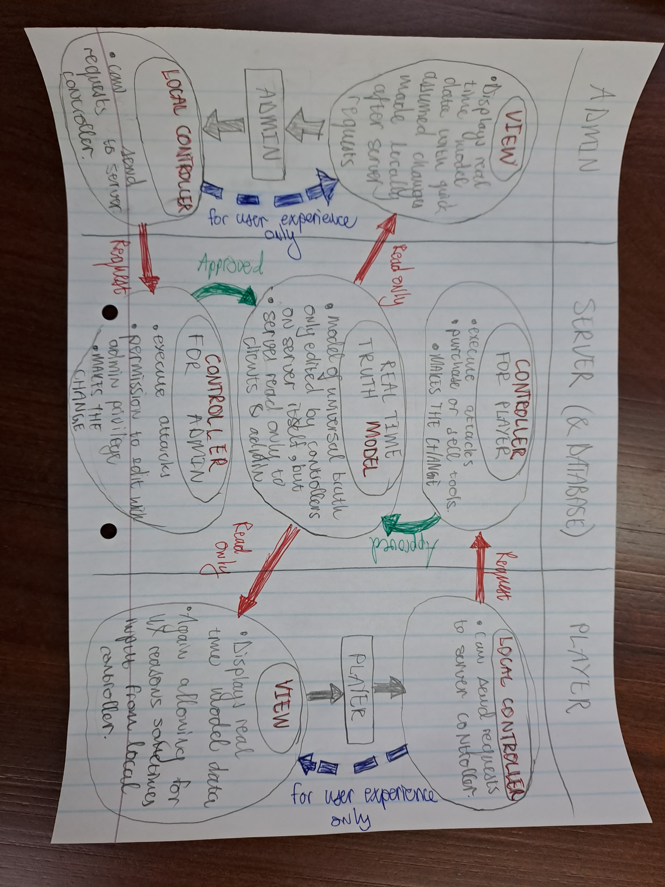

# Model View Controller  
  
Daena recommended we use Model View Controller Structure to build our game, as  
it turns out, it is a pretty good idea.  
  
Ours won't be a pure implementation so to speak, but that is to be expected  
given that we are building a web based fantasy game. Nonetheless I think it does  
a good job summarizing how our project should be implemented and helps explain  
the structure.  
  
## Unrelated Security Warning
  
You will see controllers on the server side, don't let that frighten you, this  
is maybe a bit more complex that having it on user side, but if you put it on  
user side to put it simply the whole program will be incredibly insecure.  
  
Like third grader that opens up developer view in browser can cheat himself to  
the top of the leaderboard in about 2-3 minutes unsecure.  
And unfortunately there is no way around this.  
  
The problem lies therein that if the user side code has actual access to the  
Server API, you basically have that a simple change in the javascript code  
locally can give a person access to bypass any deductions in money, while  
doing anything they have permission to do usually.  
  
I can explain this in more detail in-person, but the implications of this is  
huge. The way we were planning on doing it is not a understandable shortcut,  
just a major security flaw in the form of a program.  
  
## My proposed Model View Controller System  
  
  
  
I will leave it at that for now, but I can always explain my reasoning in person.  
We can add more details to this system and implement it exactly during the second  
or third sprint.  
